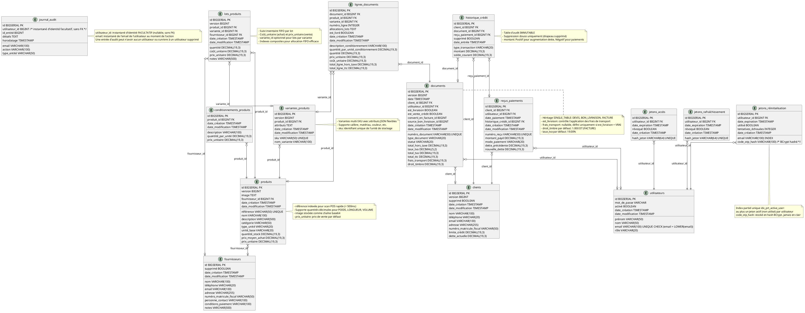
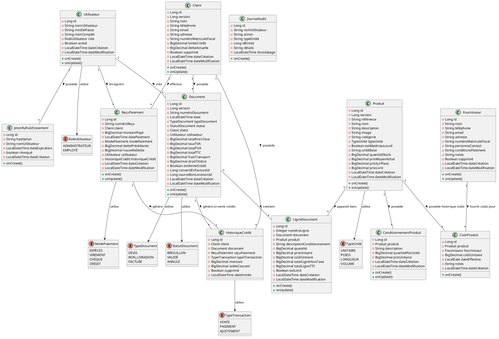
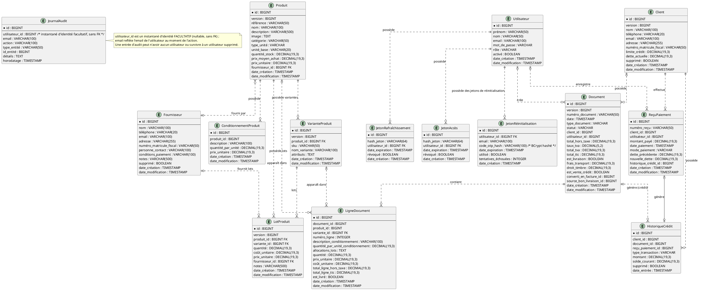

# INOVEXAHUB - Système de Gestion Commerciale et Point de Vente (POS)

[](https://github.com/mAmineChniti/hardware_store/actions/workflows/ci.yml)
[](https://codecov.io/gh/mAmineChniti/hardware_store)

Système de gestion commerciale complet pour les magasins de matériaux de construction en Tunisie, avec gestion des stocks, facturation conforme à la fiscalité tunisienne, et gestion du crédit client.

## 📋 Table des Matières

- [Vue d'ensemble](#vue-densemble)
- [Fonctionnalités](#fonctionnalités)
- [Architecture Technique](#architecture-technique)
- [Schéma de la Base de Données](#schéma-de-la-base-de-données)
- [Diagramme de Classes](#diagramme-de-classes)
- [Relations des Entités](#relations-des-entités)
- [Configuration](#configuration)
- [Installation](#installation)
- [API Documentation](#api-documentation)
- [Tests](#tests)
- [Couverture des Tests](#-couverture-des-tests)

## 🎯 Vue d'ensemble

INOVEXAHUB Hardware Store POS est une solution de gestion commerciale moderne conçue spécifiquement pour les magasins de matériaux de construction tunisiens. Le système gère:

- **Gestion des stocks** avec support pour les unités décimales (poids, longueur, volume)
- **Tarification par conditionnement** pour les produits vendus en lots (ex: rouleaux de câble)
- **Facturation tunisienne** conforme (Devis, Bon de Livraison, Facture avec TVA 19%)
- **Gestion du crédit client** avec système de carnet et historique immuable
- **Gestion des fournisseurs** avec informations et matricule fiscal
- **Authentification JWT** avec rôles (Administrateur, Employé)

## ✨ Fonctionnalités

### Gestion des Produits
- Référence unique et code-barres pour scan POS rapide
- Catégorisation des produits
- Support des unités: Unitaire, Poids, Longueur, Volume
- Variantes multi-SKU avec attributs JSON flexibles (calibre, material, etc.)
- Suivi des stocks par lot FIFO (First-In-First-Out) pour le coût d'achat
- Gestion des conditionnements avec tarification non linéaire
- Gestion du stock avec alertes de stock faible
- Verrouillage optimiste (@Version) pour la concurrence

### Gestion des Clients
- Informations complètes (nom, téléphone, email, adresse, matricule fiscal)
- Limite de crédit configurable (plafond_credit_autorise)
- Suivi de la dette actuelle en temps réel
- Système de carnet pour les paiements partiels
- Historique des transactions de crédit immuable

### Facturation Tunisienne
- **Devis** (Quote) - Document préliminaire
- **Bon de Livraison** (Delivery Note) - Avec frais de transport saisis par l'employé
- **Facture** (Invoice) - Avec droit de timbre (1 DT) et TVA 19%
- Workflow: Brouillon → Validé → Annulé
- Calcul automatique des totaux HT, TVA, TTC
- Support des ventes au crédit

### Gestion des Paiements
- Modes de paiement: Espèces, Virement, Chèque, Crédit
- Reçus de paiement avec numérotation unique
- Snapshots de la dette avant/après paiement
- Génération automatique de l'historique de crédit

### Gestion des Fournisseurs
- Informations complètes du fournisseur
- Matricule fiscal pour conformité
- Personne de contact et conditions de paiement

### Sécurité
- Authentification JWT avec tokens sécurisés
- Rôles d'utilisateur: Administrateur, Employé
- Le paramètre `adminOverride` est vérifié côté serveur (réservé aux ADMIN)
- Validation côté serveur avec Bean Validation (@NotNull, @DecimalMin, etc.)
- Journal d'audit pour les actions critiques
- Soft delete pour préservation des données

## 🏗️ Architecture Technique

### Stack Technologique

- **Backend**: Spring Boot 4.1.0
- **Base de données**: PostgreSQL
- **ORM**: Spring Data JPA / Hibernate
- **Sécurité**: Spring Security avec JWT (jjwt 0.12.6)
- **Validation**: Jakarta Bean Validation
- **Documentation API**: SpringDoc OpenAPI 3.0.3
- **Tests**: JUnit 5, Spring Boot Test, H2 (tests)
- **Build**: Gradle avec Kotlin DSL
- **Qualité de code**: Spotless, Checkstyle, SpotBugs

### Architecture en Couches

```text
┌─────────────────────────────────────────┐
│         Controllers (REST API)          │
├─────────────────────────────────────────┤
│              Services                  │
├─────────────────────────────────────────┤
│            Repositories                │
├─────────────────────────────────────────┤
│              Entities                   │
├─────────────────────────────────────────┤
│         PostgreSQL Database             │
└─────────────────────────────────────────┘
```

## 🗄️ Schéma de la Base de Données



### Tables Principales

- **users** - Utilisateurs du système avec rôles
- **clients** - Clients avec gestion de crédit
- **suppliers** - Fournisseurs de produits
- **products** - Articles en stock avec tarification
- **product_variants** - Variantes multi-SKU avec attributs JSON flexibles
- **product_batches** - Lots d'inventaire FIFO (coût d'achat par lot)
- **product_conditionings** - Conditionnements et tarifs spéciaux
- **documents** - Devis, Bons de Livraison, Factures
- **document_lines** - Lignes de documents
- **payment_receipts** - Reçus de paiement
- **credit_history** - Historique immuable du crédit
- **audit_logs** - Journal d'audit

### Caractéristiques du Schéma

- Indexes optimisés pour les requêtes fréquentes
- Contraintes d'intégrité référentielle
- Soft delete pour préservation des données
- Colonnes de timestamp automatiques
- Types de données précis pour les montants (DECIMAL 19,3)

## 📊 Diagramme de Classes



### Entités Principales

- **User** - Gestion des utilisateurs et authentification
- **Client** - Gestion des clients et crédit
- **Supplier** - Gestion des fournisseurs
- **Product** - Gestion des articles et stock
- **ProductVariant** - Variantes multi-SKU avec attributs JSON flexibles
- **ProductBatch** - Lots d'inventaire FIFO pour le suivi des coûts
- **ProductConditioning** - Conditionnements et tarifs
- **Document** - Facturation (Devis, BL, Facture)
- **DocumentLine** - Lignes de documents
- **PaymentReceipt** - Paiements clients
- **CreditHistory** - Historique de crédit immuable
- **AuditLog** - Audit des actions

### Énumérations

- **UserRole** - ADMIN, EMPLOYEE
- **UnitType** - UNITARY, WEIGHT, LENGTH, VOLUME
- **DocumentType** - QUOTE, DELIVERY_NOTE, INVOICE
- **DocumentStatus** - DRAFT, VALIDATED, CANCELLED
- **PaymentMethod** - CASH, TRANSFER, CHECK, CREDIT
- **TransactionType** - SALE, PAYMENT, ADJUSTMENT

## 🔗 Relations des Entités



### Relations Clés

- **User 1 -- * Document** - Créateur des documents
- **User 1 -- * PaymentReceipt** - Enregistreur des paiements
- **Client 1 -- * Document** - Possède les documents
- **Client 1 -- * PaymentReceipt** - Effectue les paiements
- **Client 1 -- * CreditHistory** - Historique de crédit
- **Product 1 -- * ProductConditioning** - Conditionnements
- **Product 1 -- * ProductVariant** - Variantes multi-SKU
- **Product 1 -- * ProductBatch** - Lots d'inventaire FIFO
- **ProductVariant 1 -- * ProductBatch** - Lots par variante
- **Document 1 -- * DocumentLine** - Contient les lignes
- **Document 1 -- * CreditHistory** - Génère (si crédit)
- **PaymentReceipt 1 -- 1 CreditHistory** - Génère l'historique

## ⚙️ Configuration

### Variables d'Environnement

```bash
# Base de données PostgreSQL
SPRING_DATASOURCE_URL=jdbc:postgresql://localhost:5432/hardware_store
SPRING_DATASOURCE_USERNAME=postgres
SPRING_DATASOURCE_PASSWORD=your_password

# JWT Secret
JWT_SECRET=your-secret-key-minimum-256-bits
JWT_ACCESS_EXPIRATION=900000
JWT_REFRESH_EXPIRATION=1200000

# Configuration SMTP (email)
MAIL_HOST=smtp.gmail.com
MAIL_PORT=587
MAIL_USERNAME=your_email@gmail.com
MAIL_PASSWORD=your_app_password

# OTP Configuration
OTP_EXPIRY_MINUTES=10

# Configuration serveur
SERVER_PORT=8080
```

### Configuration de la Base de Données

Le fichier `docs/database/schema.sql` contient le schéma complet de la base de données avec:

- Tables avec contraintes et indexes
- Données d'exemple pour les tests
- Commentaires explicatifs en français

## 🚀 Installation

### Prérequis

- Java 26 ou supérieur
- PostgreSQL 14 ou supérieur
- Gradle 9.x

### Étapes d'Installation

1. **Cloner le repository**
```bash
git clone https://github.com/mAmineChniti/hardware_store.git
cd hardware_store
```

2. **Configurer la base de données**
```bash
# Créer la base de données PostgreSQL
createdb hardware_store

# Exécuter le schéma
psql -U postgres -d hardware_store -f docs/database/schema.sql
```

3. **Configurer les variables d'environnement**
```bash
export SPRING_DATASOURCE_URL=jdbc:postgresql://localhost:5432/hardware_store
export SPRING_DATASOURCE_USERNAME=postgres
export SPRING_DATASOURCE_PASSWORD=your_password
export JWT_SECRET=your-secret-key
export MAIL_HOST=smtp.gmail.com
export MAIL_PORT=587
export MAIL_USERNAME=your_email@gmail.com
export MAIL_PASSWORD=your_app_password
export OTP_EXPIRY_MINUTES=10
```

4. **Lancer l'application**
```bash
./gradlew bootRun
```

5. **Accéder à l'application**
- API: http://localhost:8080
- Swagger UI: http://localhost:8080/swagger-ui/index.html

### Utilisateur par Défaut

- **Nom d'utilisateur**: admin
- **Mot de passe**: admin123
- **Rôle**: ADMINISTRATEUR

## 📚 API Documentation

### Swagger UI

L'API est documentée avec Swagger/OpenAPI et accessible à:
```text
http://localhost:8080/swagger-ui/index.html
```

### Endpoints Principaux

#### Authentification (`/api/auth`)
- `POST /api/auth/login` - Connexion utilisateur (retourne access token + refresh token JWT)
- `POST /api/auth/refresh` - Renouvelle les tokens JWT à partir d'un refresh token valide (le refresh token est rotatif : le client doit remplacer l'ancien refresh token par le nouveau retourné, l'ancien étant révoqué)
- `POST /api/auth/logout` - Déconnexion (invalide le refresh token côté serveur ; nécessite le refresh token dans le body)
- `POST /api/auth/register` - Inscription utilisateur (crée compte EMPLOYEE par défaut)
- `POST /api/auth/forgot-password` - Demander un code OTP de réinitialisation (envoyé par email)
- `POST /api/auth/reset-password` - Réinitialiser le mot de passe avec le code OTP
- `PUT /api/auth/me` - Mettre à jour son propre profil (prénom, nom, email ; utilisateur connecté)
- `PUT /api/auth/users/{id}/role` - Changer le rôle d'un autre utilisateur (EMPLOYEE ou ADMIN ; ADMIN uniquement)
- `DELETE /api/auth/users/{id}` - Suppression utilisateur (requiert authentification)

#### Clients (`/api/clients`)
- `GET /api/clients` - Récupérer tous les clients actifs
- `GET /api/clients/{id}` - Récupérer un client par ID
- `GET /api/clients/tax-id/{taxId}` - Récupérer un client par matricule fiscal
- `POST /api/clients` - Créer un nouveau client (ADMIN ou EMPLOYEE)
- `PUT /api/clients/{id}` - Mettre à jour un client (ADMIN ou EMPLOYEE)
- `DELETE /api/clients/{id}` - Supprimer un client (soft delete, ADMIN uniquement)
- `GET /api/clients/{id}/credit-limit-check` - Vérifier si une vente dépasserait la limite de crédit
- `GET /api/clients/{id}/credit-history` - Récupérer l'historique de crédit complet
- `GET /api/clients/{id}/credit-history/active` - Récupérer l'historique de crédit actif
- `GET /api/clients/{id}/payments` - Récupérer tous les reçus de paiement
- `POST /api/clients/{id}/payments` - Traiter un paiement (ADMIN ou EMPLOYEE)
- `GET /api/clients/{clientId}/payments/{receiptId}/pdf` - Générer le PDF d'un reçu de paiement
- `GET /api/clients/debtors` - Récupérer les clients avec dette
- `GET /api/clients/near-limit` - Récupérer les clients proches de leur limite de crédit

#### Produits (`/api/products`)
- `GET /api/products` - Récupérer tous les produits
- `GET /api/products/{id}` - Récupérer un produit par ID
- `GET /api/products/reference/{reference}` - Récupérer un produit par référence
- `POST /api/products` - Créer un nouveau produit avec lot initial (ADMIN ou EMPLOYEE)
- `PUT /api/products/{id}` - Mettre à jour un produit (ADMIN ou EMPLOYEE)
- `DELETE /api/products/{id}` - Supprimer un produit (ADMIN uniquement)
- `GET /api/products/search` - Rechercher des produits par mot-clé
- `GET /api/products/category/{category}` - Récupérer les produits par catégorie
- `GET /api/products/low-stock` - Récupérer les produits avec stock faible
- `GET /api/products/{productId}/conditionings` - Récupérer les conditionnements d'un produit
- `POST /api/products/{productId}/conditionings` - Ajouter un conditionnement (ADMIN ou EMPLOYEE)
- `PUT /api/products/conditionings/{id}` - Mettre à jour un conditionnement (ADMIN ou EMPLOYEE)
- `DELETE /api/products/conditionings/{id}` - Supprimer un conditionnement (ADMIN uniquement)
- `POST /api/products/{productId}/stock` - Mettre à jour la quantité en stock (ADMIN ou EMPLOYEE)

#### Batches FIFO (`/api/products/{productId}/batches`)
- `POST /api/products/{productId}/batches` - Ajouter un lot d'inventaire (ADMIN ou EMPLOYEE)
- `GET /api/products/{productId}/batches` - Récupérer les lots d'un produit
- `GET /api/products/{productId}/batches/available` - Récupérer les lots avec stock disponible
- `PUT /api/products/batches/{batchId}/quantity` - Corriger la quantité d'un lot (ADMIN ou EMPLOYEE)
- `PUT /api/products/batches/{batchId}/pricing` - Modifier le coût et le prix de vente d'un lot (ADMIN ou EMPLOYEE; le paramètre `adminOverride` est réservé aux ADMIN)
- `DELETE /api/products/batches/{batchId}` - Supprimer un lot (ADMIN ou EMPLOYEE)

#### Variantes (`/api/products/{productId}/variants`)
- `POST /api/products/{productId}/variants` - Créer une variante multi-SKU (ADMIN ou EMPLOYEE)
- `GET /api/products/{productId}/variants` - Récupérer les variantes d'un produit
- `GET /api/products/variants/{variantId}` - Récupérer une variante par ID
- `PUT /api/products/variants/{variantId}` - Mettre à jour une variante (ADMIN ou EMPLOYEE)
- `DELETE /api/products/variants/{variantId}` - Supprimer une variante (ADMIN ou EMPLOYEE)
- `POST /api/products/variants/{variantId}/batches` - Ajouter un lot pour une variante (ADMIN ou EMPLOYEE)
- `GET /api/products/variants/{variantId}/batches` - Récupérer les lots d'une variante
- `GET /api/products/variants/{variantId}/batches/available` - Récupérer les lots disponibles d'une variante

#### Documents (`/api/documents`)
- `GET /api/documents` - Récupérer tous les documents
- `GET /api/documents/{id}` - Récupérer un document par ID
- `GET /api/documents/number/{documentNumber}` - Récupérer un document par numéro
- `POST /api/documents` - Créer un nouveau document (Devis, BL, Facture) (ADMIN ou EMPLOYEE)
- `PUT /api/documents/{id}` - Mettre à jour un document (ADMIN ou EMPLOYEE)
- `DELETE /api/documents/{id}` - Supprimer un document (ADMIN uniquement)
- `GET /api/documents/{id}/lines` - Récupérer les lignes d'un document
- `POST /api/documents/{id}/lines` - Ajouter une ligne à un document (ADMIN ou EMPLOYEE)
- `PUT /api/documents/lines/{lineId}` - Mettre à jour une ligne (ADMIN ou EMPLOYEE)
- `DELETE /api/documents/lines/{lineId}` - Supprimer une ligne (ADMIN ou EMPLOYEE)
- `POST /api/documents/{id}/validate` - Valider un document (BROUILLON -> VALIDÉ) (ADMIN ou EMPLOYEE)
- `POST /api/documents/{id}/cancel` - Annuler un document (ADMIN ou EMPLOYEE)
- `POST /api/documents/{id}/convert-to-bl` - Convertir Devis en Bon de Livraison (ADMIN ou EMPLOYEE)
- `POST /api/documents/{id}/convert-to-invoice` - Convertir Bon de Livraison en Facture (ADMIN ou EMPLOYEE)
- `GET /api/documents/client/{clientId}` - Récupérer les documents d'un client
- `GET /api/documents/user/{userId}` - Récupérer les documents créés par un utilisateur
- `GET /api/documents/type/{documentType}` - Récupérer les documents par type
- `GET /api/documents/status/{status}` - Récupérer les documents par statut
- `GET /api/documents/client/{clientId}/credit-sales` - Récupérer les ventes au crédit d'un client
- `GET /api/documents/{id}/pdf` - Générer le PDF du document

#### Fournisseurs (`/api/suppliers`)
- `GET /api/suppliers` - Récupérer tous les fournisseurs actifs
- `GET /api/suppliers/{id}` - Récupérer un fournisseur par ID
- `GET /api/suppliers/tax-id/{taxId}` - Récupérer un fournisseur par matricule fiscal
- `GET /api/suppliers/search` - Rechercher des fournisseurs par nom
- `POST /api/suppliers` - Créer un nouveau fournisseur (ADMIN ou EMPLOYEE)
- `PUT /api/suppliers/{id}` - Mettre à jour un fournisseur (ADMIN ou EMPLOYEE)
- `DELETE /api/suppliers/{id}` - Supprimer un fournisseur (soft delete, ADMIN uniquement)

#### Rapports (`/api/reports`) - ADMIN uniquement
- `GET /api/reports/revenue` - Statistiques de chiffre d'affaires pour une période
- `GET /api/reports/revenue/daily` - Chiffre d'affaires quotidien pour une période
- `GET /api/reports/margin` - Statistiques de marge pour une période
- `GET /api/reports/debtors` - Rapport des débiteurs
- `GET /api/reports/debtors/near-limit` - Clients proches de leur limite de crédit
- `GET /api/reports/products/top-revenue` - Top produits par chiffre d'affaires
- `GET /api/reports/products/top-margin` - Top produits par marge
- `GET /api/reports/stock` - Rapport de stock
- `GET /api/reports/exports/sales-journal/csv` - Exporter le journal des ventes en CSV
- `GET /api/reports/exports/sales-journal/excel` - Exporter le journal des ventes en Excel
- `GET /api/reports/exports/stock/csv` - Exporter le rapport de stock en CSV
- `GET /api/reports/exports/stock/excel` - Exporter le rapport de stock en Excel

## 🧪 Tests

### Exécuter les Tests

```bash
# Tous les tests
./gradlew test

# Tests avec rapport de couverture
./gradlew test jacocoTestReport

# Ou via Make
make test
make test-coverage
```

### Qualité de Code

```bash
# Formatage du code
./gradlew spotlessApply

# Vérification Checkstyle
./gradlew checkstyleMain

# Analyse SpotBugs
./gradlew spotbugsMain

# Lint complet
./gradlew lint
```

## 📊 Couverture des Tests

Le rapport de couverture est généré via **JaCoCo** dans chaque build CI et disponible sur [Codecov](https://codecov.io/gh/mAmineChniti/hardware_store).

### Couverture Globale

| Métrique | Couvert | Total | Couverture |
|----------|---------|-------|------------|
| Instructions | 11 326 | 11 440 | **99%** |
| Branches | 724 | 764 | **94%** |
| Tests | — | 840+ | ✅ Tous passent |

### Couverture par Composant

| Composant | Instructions | Couverture |
|-----------|-------------|------------|
| AuthController | 488/496 | **98%** |
| DocumentService | 1 138/1 174 | **97%** |
| ProductService | 427/442 | **97%** |
| ClientService | 397/412 | **96%** |
| ReportingService | 1 569/1 609 | **98%** |
| PdfGenerationService | 831/870 | **96%** |
| PasswordResetService | 201/207 | **97%** |
| Security (JWT, Filtres, Config) | 470/470 | **100%** |

### Générer un Rapport

```bash
# Génère le rapport HTML + XML + CSV
make test-coverage

# Ouvrir le rapport dans le navigateur
# macOS:
open build/reports/jacoco/test/html/index.html
# Linux:
xdg-open build/reports/jacoco/test/html/index.html
# Windows:
start "" build/reports/jacoco/test/html/index.html
```

Le rapport est également généré automatiquement dans chaque build CI et envoyé à Codecov.

### Configuration

- **Plugin**: JaCoCo 0.8.15 (supporte Java 26)
- **Rapports**: HTML, XML et CSV dans `build/reports/jacoco/test/`
- **Auto-exécution**: Le rapport est automatiquement généré après chaque `make test`
- **CI**: GitHub Actions envoie le rapport XML à Codecov à chaque push/PR
